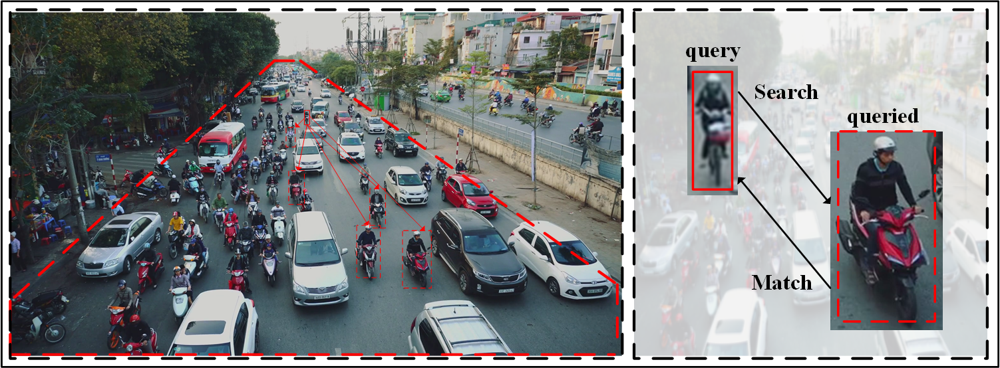

# Content-Augmented Feature Pyramid Network with Light Linear Spatial Transformers for Object Detection [[arXiv]](https://arxiv.org/ftp/arxiv/papers/2105/2105.09464.pdf)

## Overview
As one of the prevalent components, **FPN** is widely used in current object detection models for improving multi-scale object detection performance. However, its feature fusion mode is still in a **misaligned** and **local** manner, thus limiting the representation power. To address the inherit defects of FPN, a novel architecture termed Content-Augmented Feature Pyramid Network **(CA-FPN)** is proposed in this paper. Firstly, a Global Content Extraction Module **(GCEM)** is proposed to extract multi-scale context information. Secondly, lightweight **linear spatial Transformer connections** are added in the top-down pathway to augment each feature map with multi-scale features, where a **linearized approximate self-attention function** is designed for reducing model complexity. By means of the self-attention mechanism in Transformer, there is no longer need to align feature maps during feature fusion, thus solving the misaligned defect. By setting the query scope to the entire feature map, the local defect can also be solved.

  

 
The intuition of CA-FPN is from human vision system. When people are uncertain about an object in an image, they will naturally search for similar objects and combine the background information to make a more comprehensive judgment.

## Dates
- [ ] Release the implementation of CA-FPN. [to be confirmed after paper acceptance]
- [ ] Evaluate CA-FPN on the semantic segmentation task. [to be confirmed]
